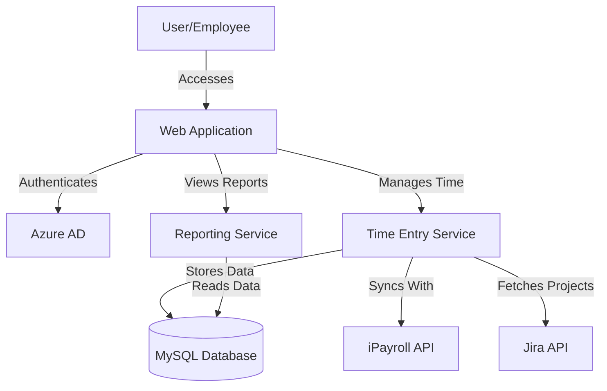
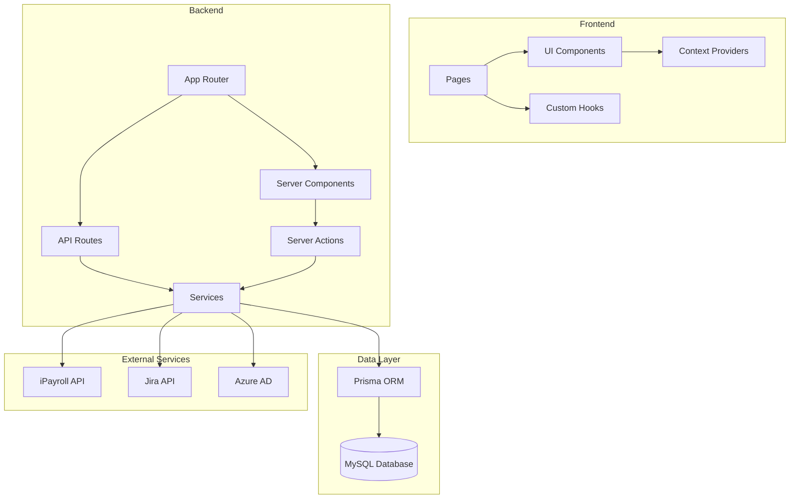
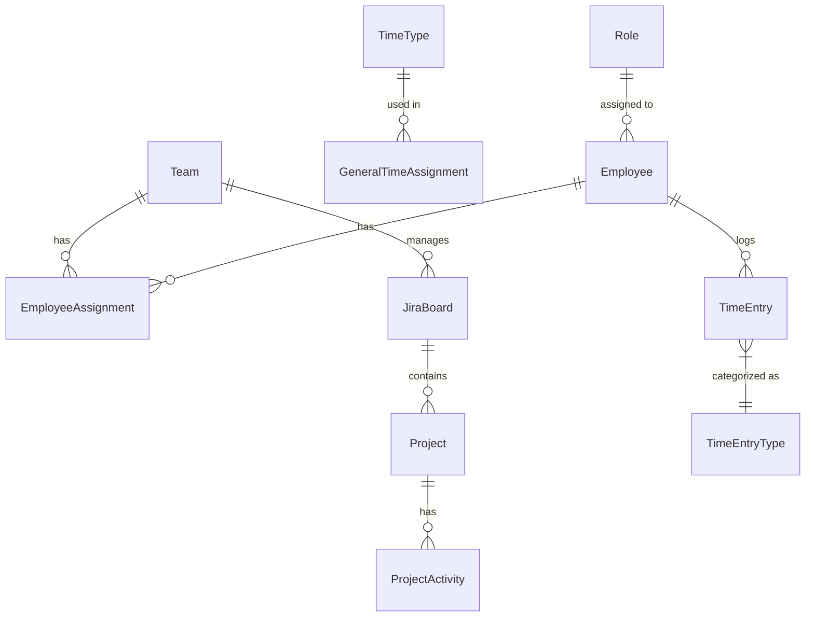
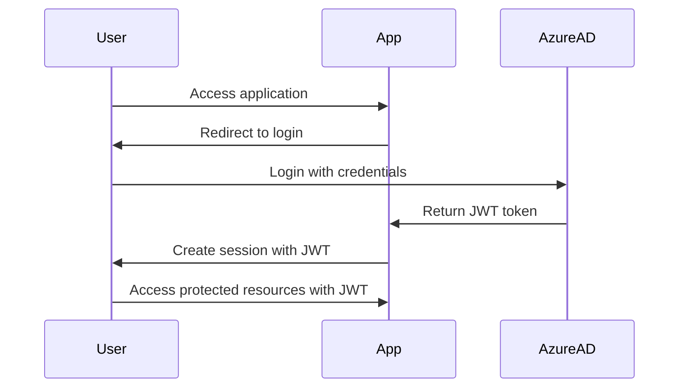
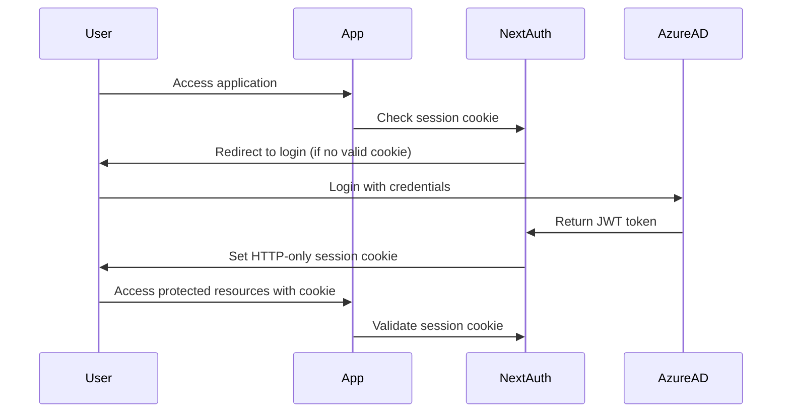
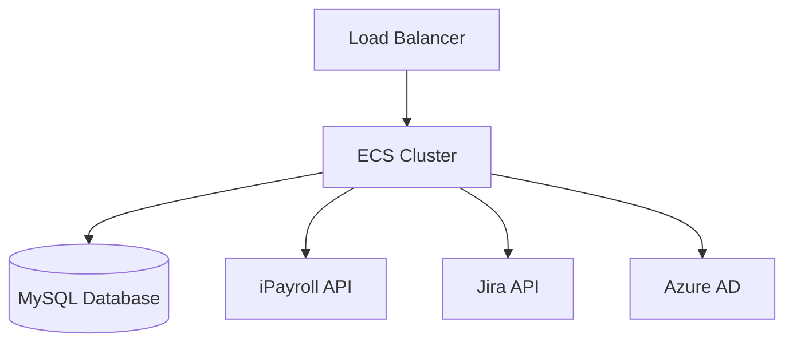
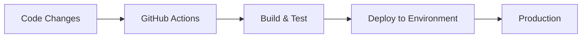
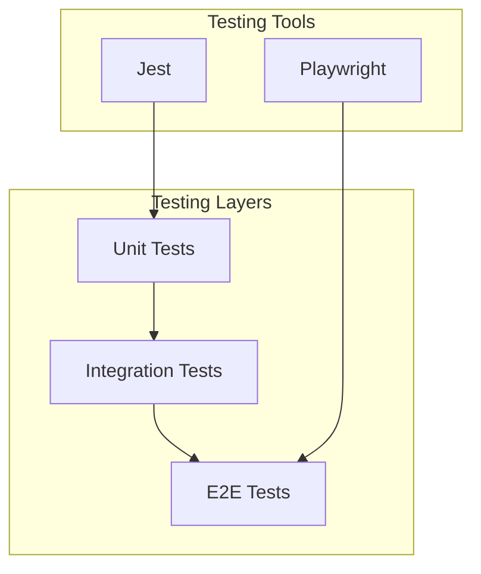

# 🏗️ ***REMOVED*** Timesheet Architecture

This document outlines the architecture of the ***REMOVED*** Timesheet application, providing an overview of its components, data flow, and deployment strategy.

## 📊 System Overview

The ***REMOVED*** Timesheet application is a Next.js-based web application that allows ***REMOVED*** employees to track and manage their time entries. It integrates with iPayroll for payroll processing and Jira for project tracking.



## 🏢 Application Architecture

The application follows a modern Next.js architecture with the App Router pattern, leveraging server components and API routes.



## 📁 Directory Structure

The application follows a well-organized directory structure:

```
src/
├── app/                  # Next.js App Router pages and API routes
│   ├── actions/          # Server actions
│   ├── api/              # API endpoints
│   ├── login/            # Authentication pages
│   ├── reports/          # Reporting pages
│   └── ...               # Other page routes
├── components/           # Reusable UI components
├── contexts/             # React context providers
├── hooks/                # Custom React hooks
├── lib/                  # Core functionality and services
│   ├── auth.ts           # Authentication logic
│   ├── db.ts             # Database connection
│   ├── prisma.ts         # Prisma client
│   └── timeReportService.ts # Time reporting service
├── store/                # State management
├── types/                # TypeScript type definitions
└── utils/                # Utility functions
```

## 🗄️ Data Model

The application uses a relational database with the following core entities:



Key entities:

- **Team**: Represents departments or teams within the organization
- **Project**: Represents projects tracked in Jira
- **TimeType**: Categorizes different types of time entries (e.g., development, meetings)
- **Employee**: Represents users of the system
- **TimeEntry**: Records time spent on activities

## 🔄 Authentication Flow

The application uses Azure AD for authentication with JWT tokens:



## 🔄 Authentication Flow

The application uses NextAuth.js with Azure AD for cookie-based authentication:



The authentication flow leverages NextAuth.js to handle the OAuth flow with Azure AD and manage secure, HTTP-only cookies for session persistence. This approach provides:

- **Security**: HTTP-only cookies protect against XSS attacks
- **Seamless UX**: Users remain authenticated between page refreshes
- **Stateless Backend**: No need to store session data in the database

## 🚀 Deployment Architecture



## 🔄 CI/CD Pipeline



## 🧪 Testing Strategy

The application employs a comprehensive testing strategy:



## 🔐 Security Considerations

- **Authentication**: Azure AD integration with MFA support
- **Session Management**: HTTP-only cookies via NextAuth.js
- **CSRF Protection**: NextAuth.js implements CSRF tokens to prevent cross-site request forgery attacks
- **Data Protection**:
  - Sensitive environment variables stored in Secrets Manager
  - Data encryption at rest via RDS
  - HTTPS for all communications
- **Access Control**:
  - Database access restricted to application
  - Role-based permissions for application features
- **API Security**:
  - iPayroll and Jira API logging
