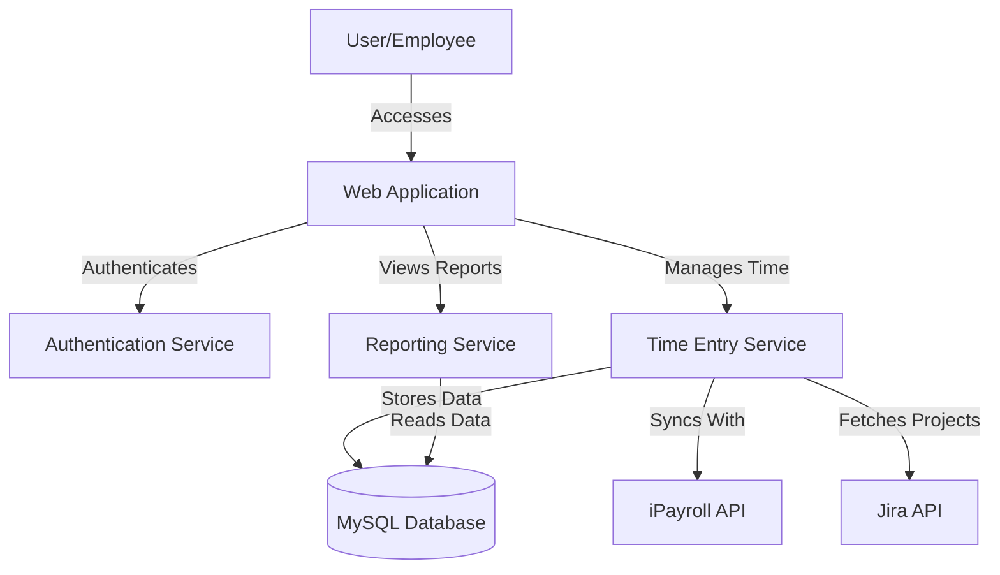
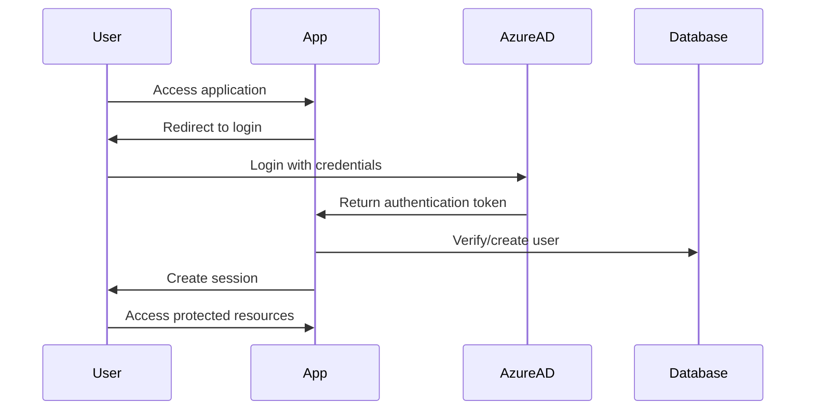

# 🏗️ ***REMOVED*** Timesheet Architecture

This document outlines the architecture of the ***REMOVED*** Timesheet application, providing an overview of its components, data flow, and deployment strategy.

## 📊 System Overview

The ***REMOVED*** Timesheet application is a Next.js-based web application that allows ***REMOVED*** employees to track and manage their time entries. It integrates with iPayroll for payroll processing and Jira for project tracking.



## 🏢 Application Architecture

The application follows a modern Next.js architecture with the App Router pattern, leveraging server components and API routes.


## 📁 Directory Structure

The application follows a well-organized directory structure:

```
src/
├── app/                  # Next.js App Router pages and API routes
│   ├── actions/          # Server actions
│   ├── api/              # API endpoints
│   ├── login/            # Authentication pages
│   ├── reports/          # Reporting pages
│   └── ...               # Other page routes
├── components/           # Reusable UI components
├── contexts/             # React context providers
├── hooks/                # Custom React hooks
├── lib/                  # Core functionality and services
│   ├── auth.ts           # Authentication logic
│   ├── db.ts             # Database connection
│   ├── prisma.ts         # Prisma client
│   └── timeReportService.ts # Time reporting service
├── store/                # State management
├── types/                # TypeScript type definitions
└── utils/                # Utility functions
```

## 🗄️ Data Model

The application uses a relational database with the following core entities:


Key entities:

- **Team**: Represents departments or teams within the organization
- **Project**: Represents projects tracked in Jira
- **TimeType**: Categorizes different types of time entries (e.g., development, meetings)
- **Employee**: Represents users of the system
- **TimeEntry**: Records time spent on activities

## 🔄 Authentication Flow

The application uses Azure AD for authentication:



## 🚀 Deployment Architecture


## 🔄 CI/CD Pipeline


## 🧪 Testing Strategy

The application employs a comprehensive testing strategy:


## 🔐 Security Considerations

- Authentication via Azure AD (including MFA)
- Sensitive environment variables stored in Secrets Manager
- HTTPS for all communications
- Database access restricted to application
- Data encryption at rest via RDS
- iPayroll and Jira API logging
