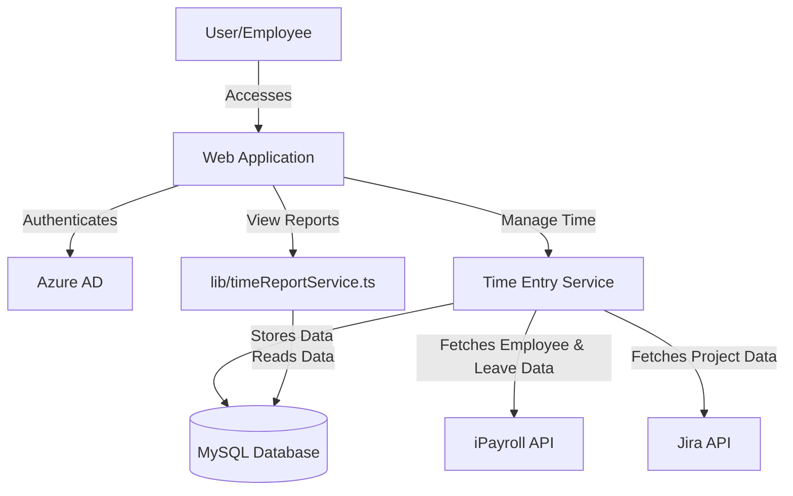
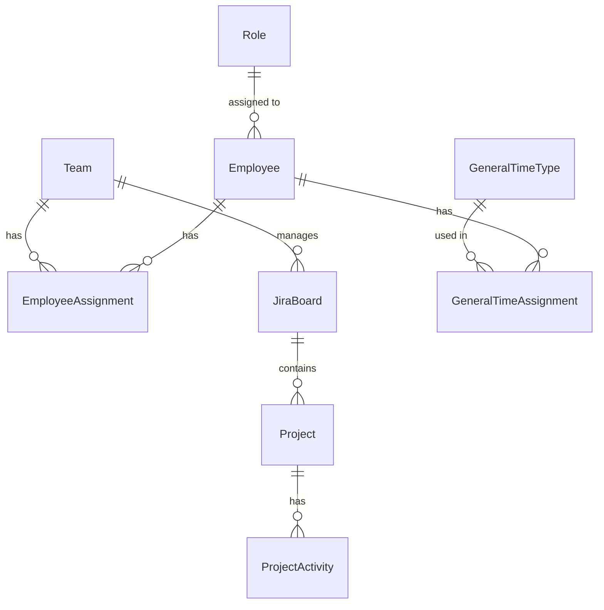
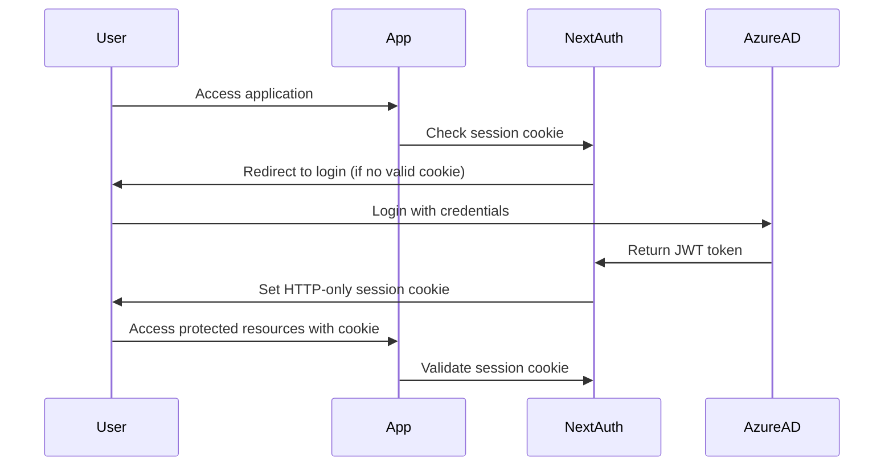
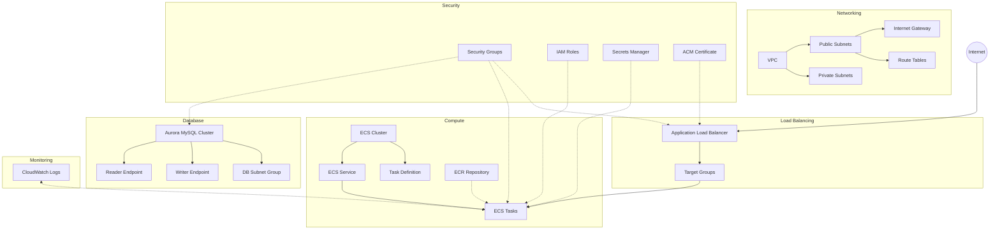
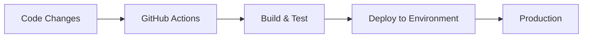
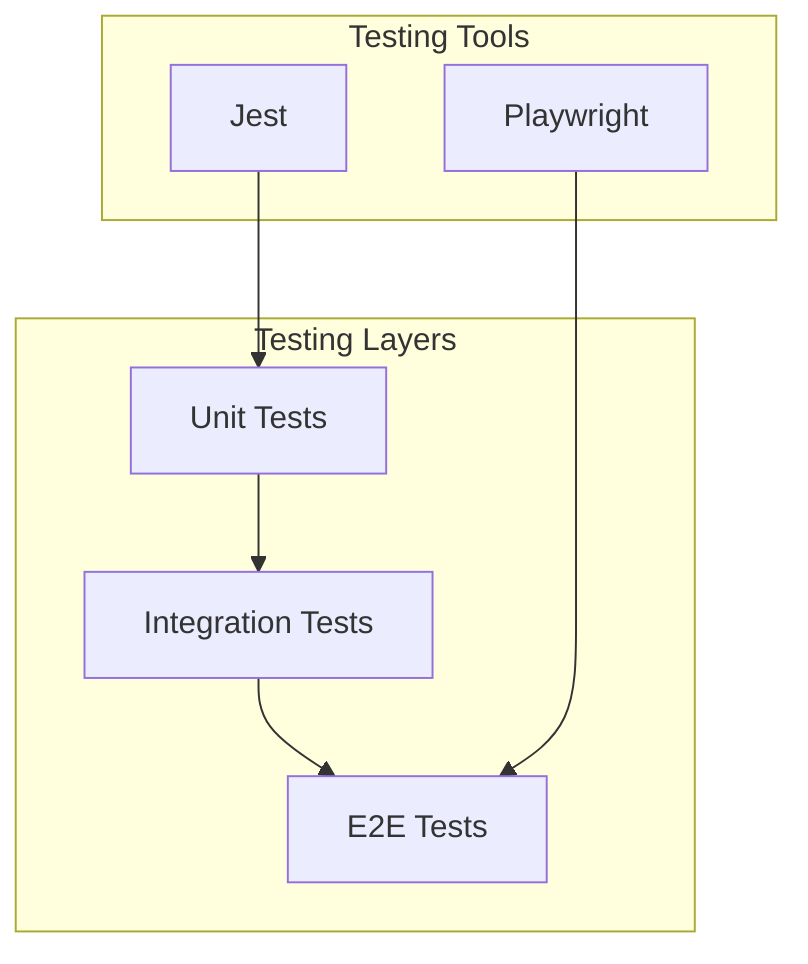

# 🏗️ Architecture

This document outlines the architecture of the CapDev Reporter application, providing an overview of its components, data flow, and deployment strategy.

## 📊 System Overview

The CapDev Reporter application is a Next.js-based web application that allows employees to track and manage their time entries. It integrates with iPayroll for payroll processing and Jira for project tracking.

## 🗄️ Data Model

The application uses a relational database with the following core entities:

Key entities:

- **Team**: Represents departments or teams within the organization
- **Project**: Represents projects tracked in Jira
- **GeneralTimeType**: Categorizes different types of general time entries (e.g., development, meetings)
- **Employee**: Represents employees of the organization
- **EmployeeAssignment**: Associates employees with teams
- **GeneralTimeAssignment**: Defines expected time allocations for employees based on their role

## 🔄 Authentication Flow

The application uses NextAuth.js with Azure AD for cookie-based authentication:

The authentication flow leverages [NextAuth.js](https://next-auth.js.org/) to handle the OAuth flow with Azure AD and manage secure, HTTP-only cookies for session persistence. This approach provides:

- **Security**: HTTP-only cookies protect against XSS attacks
- **Seamless UX**: Users remain authenticated between page refreshes
- **Stateless Backend**: No need to store session data in the database

## ☁️ AWS Infrastructure

The application is deployed on AWS using the following resources:

### Networking

- **VPC**: Dedicated Virtual Private Cloud with CIDR block 10.0.0.0/16
- **Subnets**:
  - 2 public subnets in different availability zones for the ECS cluster
  - 2 private subnets in different availability zones for the RDS database
- **Internet Gateway**: Provides internet access to the public subnets
- **Route Tables**: Configured to route traffic appropriately between subnets

### Compute & Container Services

- **ECS Cluster**: Manages the containerized application
- **ECS Task Definition**: Defines the container specifications, resource requirements, and environment variables
- **ECS Service**: Ensures the desired number of tasks are running and handles load balancing
- **ECR Repository**: Stores Docker images with lifecycle policies to manage image retention

### Database

- **Aurora MySQL Cluster**: Managed, highly available MySQL-compatible database cluster
  - Writer endpoint for write operations
  - Reader endpoint for read operations (scalable read replicas)
- **DB Subnet Group**: Spans multiple availability zones for high availability

### Load Balancing & Networking

- **Application Load Balancer (ALB)**: Distributes incoming traffic across ECS tasks
- **Target Groups**: Routes requests to healthy ECS tasks
- **Security Groups**: Controls inbound and outbound traffic for ECS, ALB, and RDS

### Security & IAM

- **IAM Roles**:
  - ECS Task Execution Role: Allows ECS to pull images and write logs
  - ECS Task Role: Provides permissions for the application to access AWS services
- **Secrets Manager**: Securely stores sensitive configuration like database credentials
- **ACM Certificate**: Manages SSL/TLS certificate for HTTPS connections

### Monitoring & Logging

- **CloudWatch Log Group**: Collects and stores application logs from containers

## 🔄 CI/CD Pipeline

### GitHub Actions Workflow Permissions

The `deploy-ecs.yml` workflow uses AWS credentials to deploy the application to ECS. The workflow requires the following permissions:

- **AWS Access**: Uses AWS access keys stored as GitHub secrets (`AWS_ACCESS_KEY_ID` and `AWS_SECRET_ACCESS_KEY`) for the `capdevreporter-github-actions-ecr` user
- **ECR Access**: Permissions to authenticate, build, and push Docker images to Amazon ECR (`AmazonEC2ContainerRegistryPowerUser` policy)
- **ECS Deployment**: Permissions to update ECS services and force new deployments (Customer managed policy with `ecs:UpdateService` and `ecs:DescribeServices` for the ECS cluster)

## 🧪 Testing Strategy

The application employs a comprehensive testing strategy:

## 🔐 Security Considerations

- **Authentication**: Azure AD integration with MFA support
- **Session Management**: HTTP-only cookies via NextAuth.js
- **CSRF Protection**: NextAuth.js implements CSRF tokens to prevent cross-site request forgery attacks
- **Data Protection**:
  - Sensitive environment variables stored in Secrets Manager
  - Data encryption at rest via RDS
  - HTTPS for all communications
- **Access Control**:
  - Database access restricted to application
  - Office IP only access to the application
- **API Security**:
  - iPayroll and Jira API logging
  - Secrets stored in AWS Secrets Manager
  - Access and refresh tokens not stored
