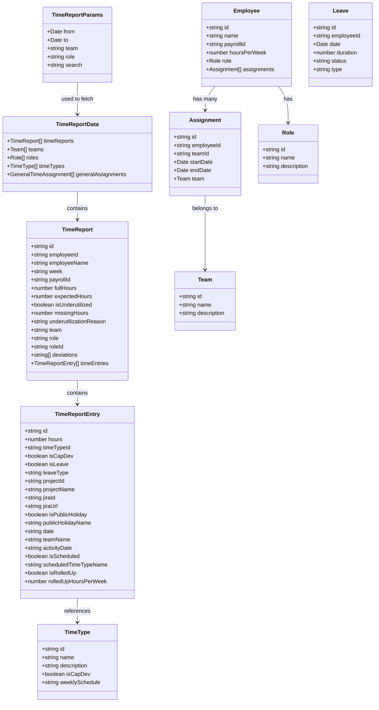
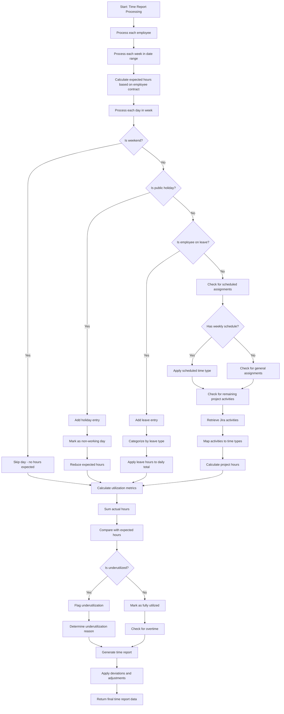

# Time Reporting System

This document explains the structure and flow of the time reporting system.

## System Overview

The time reporting system tracks employee time entries, leave records, and project activities. It allows filtering by team, role, and search terms, and calculates utilization metrics.

## Data Model

## Process Flow

## Key Functions

1. **getTimeReportData**: Main function that retrieves and processes time report data
2. **parseWeeklySchedule**: Parses the weekly schedule JSON from the database
3. **isDateOnScheduledDay**: Checks if a date falls on a scheduled day of the week

## Time Entry Sources

Time entries can come from multiple sources:

- Project activities tracked in Jira
- Leave records (vacation, sick leave, etc.)
- Public holidays
- General time assignments
- Scheduled assignments based on weekly schedules

The system aggregates all these sources to create a comprehensive view of how employees spend their time.
